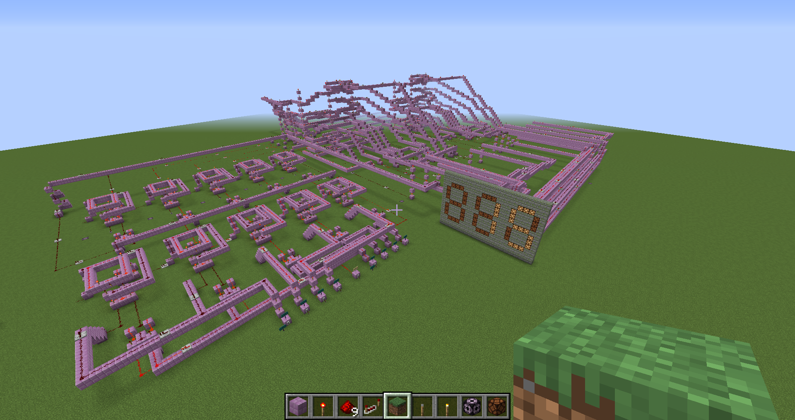

# Minecraft-Adder-with-Display
This is a project I have done in the Computer Architecture.

## Introduction

I designed a whole structure to implement the simulation of 4-bit addition and subtraction functions, and then display the result through a 7-segment display wall. The whole structure works well, and has a overall computational time of around 9s. The main reason for the high delay is due to the heavy use of Redstone Repeaters which cannot be avoided. The overall view of the structure is shown below:

## How to use it

1. Navigate to the [Release page](https://github.com/jingye-xu/Minecraft-Adder-with-Display/releases), Download the `Minecraft.addition.by.jy.zip`.  
2. Extract the zip file and save the whole directory to `Minecraft Directory/saves/`
3. Open Minecraft and enjoy!

## [Minecraft Directory](https://minecraft.fandom.com/wiki/.minecraft)
